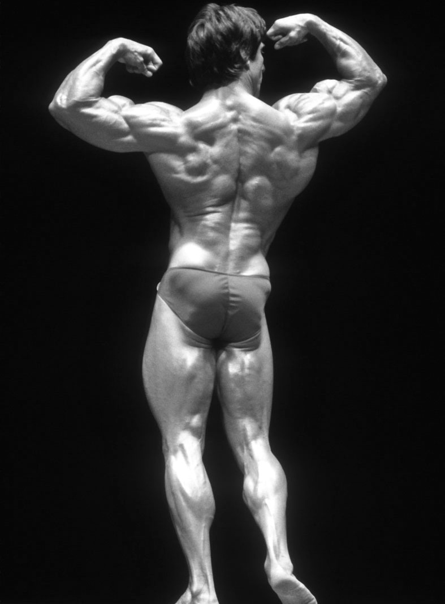

# Body Building

## Basic
### Level 1
| Workout #1 (Mon) | Workout #2 (Tue) | Workout #3 (Wed) | Workout #1 (Thu) | Workout #2 (Fri) | Workout #3 (Sat) |
|------------------|------------------|------------------|------------------|------------------|------------------|
| Chest            | Shoulders        | Thighs           | Chest            | Shoulders        | Thighs           |
| Back             | Upper Arms       | Calves           | Backs            | Upper Arms       | Calves           |
|                  | Forearms         | Lower Back       |                  | Forearms         | Lower Back       |
| Abnominals       | Abnominals       | Abnominals       | Abnominals       | Abnominals       | Abnominals       |

#### Workout #1 (Mon, Thu)
##### Chest
- Bench Press 仰卧推举
- Incline Bench Press 上斜推举
- Pullovers 仰卧上拉

##### Back
- Chin-Ups 引体向上 (do as many as you can at a time until you reach a total of 50 reps)
- Bent-Over Rows 俯身划船
- *Power Training*
	- Deadlifts 硬拉 (3x: 10-6-4 reps to failure)

##### Abdominals
- Crunches 卷腹 (5x25)

#### Workout #2 (Tue, Fri)
##### Shoulders
- Barbell Clean And Press 提铃上举
- Dumbbell Lateral Raises 哑铃侧平举
- *Power Training*
	- Heavy Upright Row 大重量直立划船 (3x: 10-6-4 reps to failure)
	- Push Presses 借力推举 (3x: 10-6-4 reps to failure)

##### Upper Arms
- Standing Barbell Curls 站姿杠铃弯举
- Seated Dumbbell Curls 坐姿哑铃弯举
- Close-Grip Press 窄握推举
- Standing Triceps Extensions with Barbell 站姿杠铃屈臂伸

##### Forearms
- Wrist Curl 腕弯举
- Reverse Wrist Curl 反握腕弯举

##### Abdominals
- Reverse Crunches 反向卷腹 (5x25)

#### Workout #3 (Wed, Sat)
##### Thighs
- Squats 深蹲
- Lunges 弓步
- Leg Curls 腿弯举

##### Calves
- Standing Calf Raises 站姿提踵 (5x15)

##### Lower Back
- *Power Training*
  - Straight-Leg Deadlifts 直腿硬拉 (3x: 10-6-4 reps to failure)
  - Good Mornings 负重体前屈 (3x: 10-6-4 reps to failure)

##### Abdominals
- Crunches 卷腹 (5x25)

### Level 2
| Workout #1 (Mon) | Workout #2 (Tue) | Workout #1 (Wed) | Workout #2 (Thu) | Workout #1 (Fri) | Workout #2 (Sat) |
|------------------|------------------|------------------|------------------|------------------|------------------|
| Chest            | Shoulders        | Chest            | Shoulders        | Chest            | Shoulders        |
| Back             | Lower Back       | Back             | Lower Back       | Back             | Lower Back       |
| Thighs           | Upper Arms       | Thighs           | Upper Arms       | Thighs           | Upper Arms       |
| Calves           | Forearms         | Calves           | Forearms         | Calves           | Forearms         |
| Abnominals       | Abnominals       | Abnominals       | Abnominals       | Abnominals       | Abnominals       |

#### Workout #1 (Mon, Wed, Fri)
##### Chest
- Bench Press 仰卧推举
- Incline Bench Press 上斜推举
- Pullovers 仰卧上拉

##### Back
- Chin-Ups 引体向上 (do as many as you can at a time until you reach a total of 50 reps)
- Bent-Over Rows 俯身划船
- *Power Training*
	- Deadlifts 硬拉 (3x: 10-6-4 reps to failure)

##### Thighs
- Squats 深蹲
- Lunges 弓步
- Leg Curls 腿弯举

##### Calves
- Standing Calf Raises 站姿提踵 (5x15)

##### Abdominals
- Crunches 卷腹 (5x25)

#### Workout #2 (Tue, Thu, Sat)
##### Shoulders
- Barbell Clean And Press 提铃上举
- Dumbbell Lateral Raises 哑铃侧平举
- *Power Training*
	- Heavy Upright Row 大重量直立划船 (3x: 10-6-4 reps to failure)
	- Push Presses 借力推举 (3x: 10-6-4 reps to failure)

##### Lower Back
- *Power Training*
  - Straight-Leg Deadlifts 直腿硬拉 (3x: 10-6-4 reps to failure)
  - Good Mornings 负重体前屈 (3x: 10-6-4 reps to failure)

##### Upper Arms
- Standing Barbell Curls 站姿杠铃弯举
- Seated Dumbbell Curls 坐姿哑铃弯举
- Close-Grip Press 窄握推举
- Standing Triceps Extensions with Barbell 站姿杠铃屈臂伸

##### Forearms
- Wrist Curl 腕弯举
- Reverse Wrist Curl 反握腕弯举

##### Abdominals
- Reverse Crunches 反向卷腹 (5x25)

---

## Advanced

| Workout #1 (Mon, Wed, Fri) | Workout #2 (Tue, Thu, Sat) |
|------------------|------------------|
| Chest            | Shoulders           |
| Back              | Upper Arms       |
| Thighs           | Forearms         |
| Calves           | Lower Back       |
| Abnominals  | Abnominals  |

### Level 1
#### Workout #1 (Mon, Wed, Fri)
##### Chest
- 哑铃飞鸟 (3x: 10-8-6)
- Bench Press 仰卧推举 (一三杠铃，五哑铃 4x: 10-8-6-4, 递减法2x12)
- Incline Bench Press 上斜推举 (一三杠铃，五哑铃 4x: 10-8-6-4, 递减法2x12)
- 双杠屈臂伸或屈伸机 (3x: 15-10-8)
- Pullovers 仰卧上拉  (3x15)

##### Back
- Chin-Ups 引体向上 (do as many as you can at a time until you reach a total of 50 reps)
- In-front lat pull down 坐姿下拉 (4x10)
- Behind-neck Lat pull down 坐姿颈后下拉(4x10)
- T-bar Rows T杠划船 (4x: 15-12-8-6)
- Bent-Over Rows 俯身划船 (4x12)
- *Power Training*
	- Deadlifts 硬拉 (3x: 10-6-4 reps to failure)

##### Thighs
- Squats 深蹲 (5x20)
- Leg Curls 腿弯举 (4x: 10-8-8-6)

##### Abdominals
- Crunches 卷腹 (5x25)

#### Workout #2 (Tue, Thu, Sat)
##### Shoulders
- Barbell Clean And Press 提铃上举
- Dumbbell Lateral Raises 哑铃侧平举
- *Power Training*
	- Heavy Upright Row 大重量直立划船 (3x: 10-6-4 reps to failure)
	- Push Presses 借力推举 (3x: 10-6-4 reps to failure)

##### Upper Arms
- Standing Barbell Curls 站姿杠铃弯举
- Seated Dumbbell Curls 坐姿哑铃弯举
- Close-Grip Press 窄握推举
- Standing Triceps Extensions with Barbell 站姿杠铃屈臂伸

##### Forearms
- Wrist Curl 腕弯举
- Reverse Wrist Curl 反握腕弯举

##### Lower Back
- *Power Training*
  - Straight-Leg Deadlifts 直腿硬拉 (3x: 10-6-4 reps to failure)
  - Good Mornings 负重体前屈 (3x: 10-6-4 reps to failure)

##### Abdominals
- Reverse Crunches 反向卷腹 (5x25)

[Ref]: Https://Www.Amazon.Com/New-Encyclopedia-Modern-Bodybuilding-Updated-Ebook/Dp/B007US9NA8
